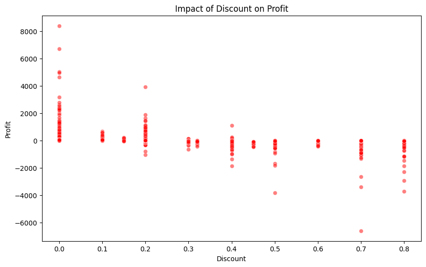
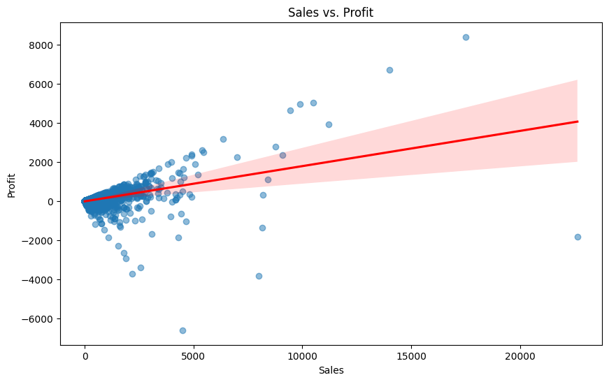

# 📌 Superstore Sales Analysis
Data-Driven Insights to Improve Profitability & Reduce Losses.

## Project Overview
A Superstore owner provided 9,994 transactions across 21 features, seeking insights to improve revenue and minimize losses.<br>
This project explores key business aspects using Python (Pandas, Seaborn, Matplotlib) to extract insights and visualize trends.

### 🔍 Key Objectives:

- Identify which product categories & subcategories drive profit vs. loss.
- Understand the impact of discounts on revenue and profitability.
- Analyze sales performance trends to improve decision-making.
- Provide data-driven recommendations to boost business growth.

### Here are some key visuals from our analysis:

**Profit vs. Discount Relationship:**
<br>

**Sales vs Profit:**<br>


### How to Use This Project
- Clone this repository
```sh
git clone git@github.com:hadihassanbaloch/Super-Store-Profit-Sales-Analysis.git
```
- Activate Env:
```sh
venv\Scripts\activate
```
- Install dependencies:
```sh
pip install -r requirements.txt
```
